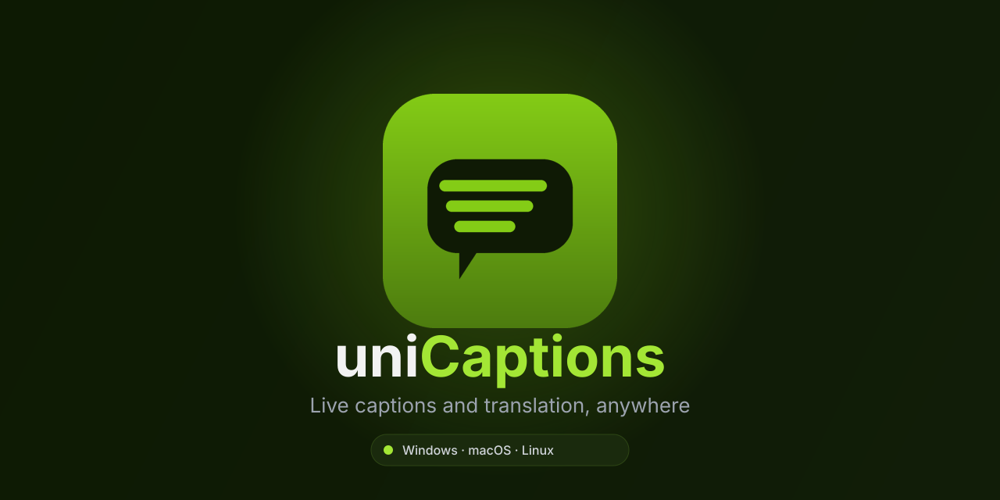

<p align="center">
  
</p>

<p align="center">
  <b>Live captions and translation, anywhere.</b><br />
  A lightweight, cross-platform desktop overlay that captions your microphone or system audio in real time — locally or in the cloud.
</p>

<p align="center">
  Windows · macOS · Linux
</p>

---

## Features

- **Live captions** from your microphone or system audio (e.g. video calls, media playback)
- **Local speech recognition** via [whisper.cpp](https://github.com/ggerganov/whisper.cpp) — offline, private, free — with selectable model sizes (tiny → medium)
- **Cloud speech recognition** via the OpenAI Whisper API, if you'd rather trade privacy for accuracy on lower-power machines
- **Live translation** into another language as captions appear, locally via ONNX Runtime ([Helsinki-NLP OPUS-MT](https://huggingface.co/Helsinki-NLP)) or via the DeepL API
- **Fully configurable overlay**: font, size, color, background, outline, position, and click-through behavior
- **System tray** support, autostart on login, and an optional "start captioning automatically" switch
- **8 supported UI languages**: English, Spanish, French, German, Polish, Portuguese, Chinese, Japanese

## Getting started

### Prerequisites

- [Node.js](https://nodejs.org/) + [pnpm](https://pnpm.io/)
- [Rust](https://rustup.rs/) (stable toolchain)
- Platform build tools for [Tauri](https://tauri.app/start/prerequisites/)
- `cmake` and LLVM (`libclang`) — required by `whisper-rs` and `ort` at build time

### Development

```sh
pnpm install
pnpm tauri dev
```

### Building

```sh
pnpm tauri build
```

Produces platform installers (MSI/NSIS on Windows, DMG on macOS, AppImage/deb on Linux) under `src-tauri/target/release/bundle/`.

## How it works

Audio is captured via [`cpal`](https://github.com/RustAudio/cpal) (microphone) or WASAPI loopback (system audio on Windows), resampled to 16kHz mono, and streamed through a rolling buffer to the active speech recognition backend. Recognized text is optionally passed through a translation backend and emitted to a transparent, always-on-top overlay window, independent from the main Settings window.

Speech and translation models are downloaded on demand into the app's data directory the first time they're used, and can be managed (downloaded/deleted) from the **Models** tab.

## Tech stack

| | |
|---|---|
| App framework | [Tauri](https://tauri.app/) |
| UI | React + TypeScript |
| Local speech recognition | [whisper.cpp](https://github.com/ggerganov/whisper.cpp) via `whisper-rs` |
| Local translation | [ONNX Runtime](https://onnxruntime.ai/) (`ort`) running Helsinki-NLP OPUS-MT models |
| Audio capture | `cpal`, `wasapi` |

## Author

Created by [RikoDEV](https://riko.dev)
